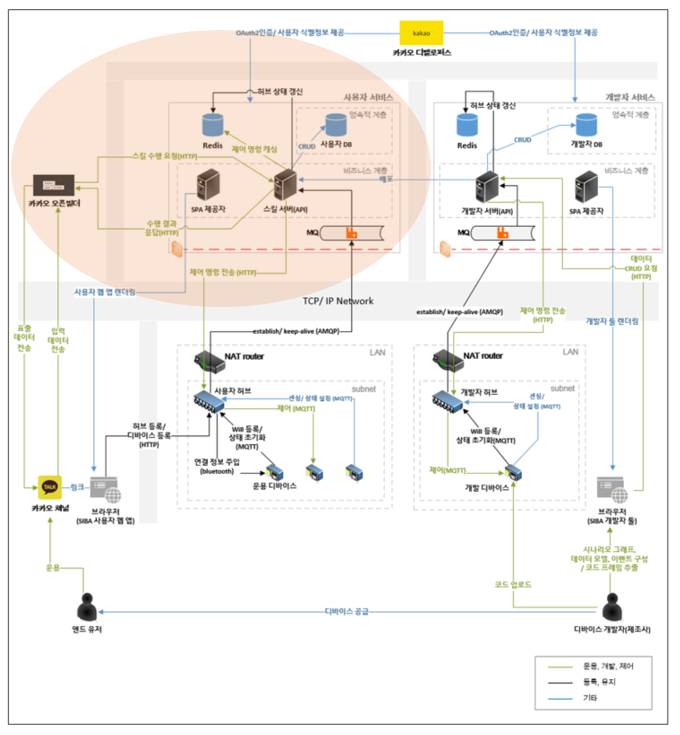
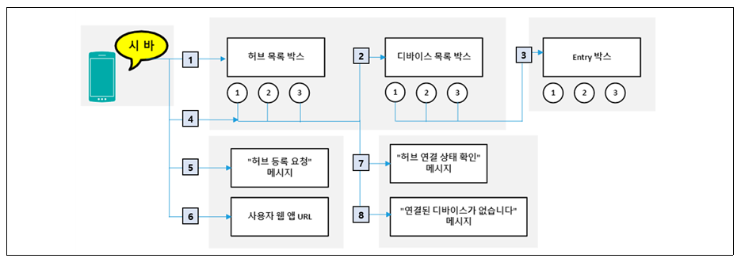
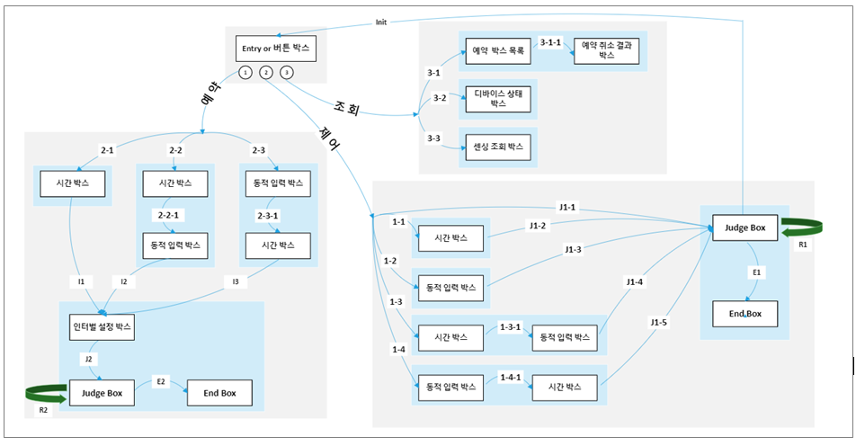

#  SIBA-USER-BE 

### Module Instruction
-----------

해당 서버 모듈은 SIBA 플랫폼 내에서 사용자 측면 인터페이스(사용자용 웹 애플리케이션, 카카오 채널(오픈빌더))로 부터의 요청을 처리함으로써 실사용자의 운용에 있어서 주된 역할을 수행하는 서버 모듈이다. 특히 카카오 채널로 부터 요청받을 시에 특정 입력들은 처리 알고리즘에 의해서 가공되어 실사용자의 공간내에 배치된 IoT Hub로 전송되어진다. 해당 모듈은 서비스 운용을 위해 RabbitMQ, Redis를 주요하게 사용하며 사용자 웹 애플리케이션, 오픈빌더, 실사용자 IoT Hub, 개발자 서버 모듈과 직접적인 데이터 통신을 수행한다.

 

### Command Building Feature Description
-----------

커맨드 빌딩은 스킬 서버 모듈 내에서 가장 핵심적인 기능입니다. 실사용자는 카카오 채널 인터페이스를 이용해서 본인이 제어하고자 하는 타겟 디바이스의 동작을 조작할 수 있도록 실내에 배치된 IoT Hub로 명령어 집합을 전송할 수 있는데 이러한 명령어 집합을 생성하기 위해 사용되는 알고리즘이 커맨드 빌딩 기능입니다. 커맨드 빌딩은 목적지 빌딩과 명령어 집합 빌딩 단계로 시나리오가 나뉘어 집니다. 목적지 빌딩은 실사용자가 제어하고자 하는 타겟 디바이스와 디바이스가 연결되어 있는 IoT Hub를 선택하는 단계입니다. 명령어 집합 빌딩은 실사용자가 제어하고자 하는 타겟 디바이스가 정해진 이후에 디바이스 개발자에 의해 배포되어진 디바이스 시나리오와 카카오 채널 인터페이스를 이용한 사용자 입력에 따라서 수행된다.

	<strong>목적지 빌딩 순서도</strong>
	

 
 

	<strong>명령어 집합 빌딩 순서도</strong>
	

 
 

### Development Skill Stack
-----------

| 분류 | 기술 |
|---|:---:|
| `Tool`| IntelliJ, Toad |
| `Language` | Java, SQL |
| `Framework` | Spring Boot |
| `DBMS` | MariaDB |
| `NoSQL` | Redis |
| `Broker` | RabbitMQ |
| `OS` | Cent OS |
